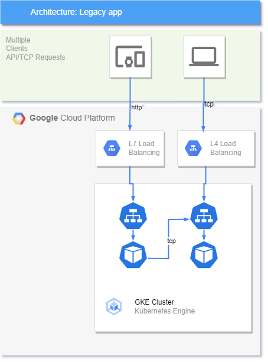

Exercise 1

**Objective: Deploy a non-secure legacy application**

*(this is a warm-up exercise)*

The provided manifests will deploy and expose 2 workloads (httpbin and tcp-echo) that will illustrate how these workloads can be exposed externally to the cluster without a Service Mesh.

Even though the Ingress resource could be secured with TLS support it is not essential for this excersise as we will expose lately these workloads through a single Ingress gateway in Istio.

Hints:
* Use your team/user name as the name of your namespace: <team_name>-ns
* Use the follow commands to successfully test httpbin `curl -Lv http://$INGRESS_IP:80/headers` and tcp-echo workloads `echo "port 31400" | nc $INGRESS_IP 31400 | grep "hello" && echo 'connection succeeded' || echo 'connection rejected'`

