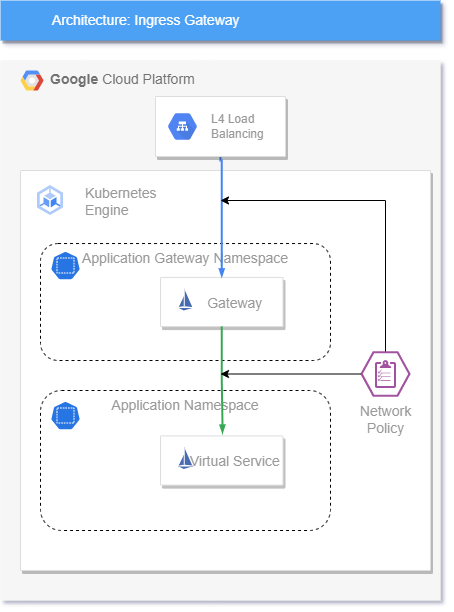

Exercise 2

**Objective: Create an Ingress Gateway**

An Ingress Gateway is the most common pattern to expose multiple workloads (https://microservices.io/patterns/apigateway.html) externally using a single entry point can then be secured and apply advanced network capabilities.

Istio provide it's own Operator to install an Ingress Gateway, however for this exercise we will follow a best practice provided by Google 

Hints: 
* Follow instructions here https://cloud.google.com/service-mesh/docs/gateways#deploy_gateways 
* Create the ingress gateway on its own namespace: <team_name>-ingress-ns
* We are using Istio and not ASM, hence intio-autoinjection label still required

Bonus: Escale Ingress to 1 replica to save resources in the workshop
